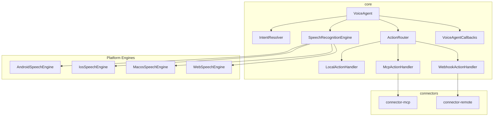
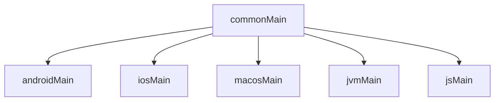

# V8V

An open-source, cross-platform voice orchestration framework built with **Kotlin Multiplatform**. Uses **native on-device speech-to-text** to turn spoken language into **local app actions**, **cross-app commands via MCP**, or **remote workflows via webhooks** — offline-first, multilingual, and privacy-respecting.

```
Microphone → Native STT → Transcript → Intent Resolver → Action Router
                                                           ├── LOCAL  (in-app lambda)
                                                           ├── MCP    (local cross-app)
                                                           └── REMOTE (n8n webhook)
```

No audio upload by default. Everything runs on-device unless explicitly configured otherwise.

---

## Platform Support

| Platform | Status | Engine | Distribution |
|----------|--------|--------|-------------|
| Android | Available | `android.speech.SpeechRecognizer` | Maven Central / Gradle |
| iOS | Available | `SFSpeechRecognizer` + `AVAudioEngine` | XCFramework / SPM |
| macOS | Available | `SFSpeechRecognizer` + `AVAudioEngine` | XCFramework / SPM |
| Web | Available | Web Speech API | npm / `<script>` |
| JVM (Desktop) | Core only | Bring your own engine | Maven Central |
| Windows | Planned | — | — |
| Linux | Planned | — | — |

### Compatibility Matrix

| Dependency | Minimum | Tested |
|-----------|---------|--------|
| **Android SDK** | API 24 (Android 7.0) | API 35 (Android 15) |
| **iOS** | 16.0 | 17+ |
| **macOS** | 13.0 (Ventura) | 14+ (Sonoma) |
| **Web Browser** | Chrome 33+ / Edge 79+ | Chrome 120+ |
| **Safari (Web)** | Not supported (no Web Speech API) | — |
| **Firefox (Web)** | Not supported (no Web Speech API) | — |
| **JDK** | 17 | 17 |
| **Kotlin** | 2.1.20 | 2.1.20 |
| **Gradle** | 8.0 | 8.7+ |
| **Xcode** | 15.0 | 15+ |
| **Ktor** | 3.0.3 | 3.0.3 |
| **Node.js** (MCP server) | 18+ | 20+ |

## Architecture



### Source Set Hierarchy



### Project Structure

```
v8v/
├── core/                  # Platform-agnostic: VoiceAgent, IntentResolver, ActionRouter
│   ├── commonMain/        # Shared Kotlin code + VoiceAgentCallbacks
│   ├── androidMain/       # Android SpeechRecognizer
│   ├── iosMain/           # iOS SFSpeechRecognizer + AVAudioSession
│   ├── macosMain/         # macOS SFSpeechRecognizer (no AVAudioSession)
│   ├── jsMain/            # Web Speech API + @JsExport facade
│   └── jvmMain/           # JVM stub
├── connector-mcp/         # MCP client (JSON-RPC 2.0 over local HTTP)
├── connector-remote/      # Webhook client (n8n, Zapier, Make, etc.)
├── example-android/       # Android app — all 3 scopes + embedded mock MCP server
├── example-ios/           # iOS SwiftUI app — all 3 scopes + settings
├── example-macos/         # macOS SwiftUI app — all 3 scopes + settings + MCP test
├── example-web/           # Web app — all 3 scopes (HTML + vanilla JS, no bundler)
├── example-jvm/           # JVM CLI app — all 3 scopes (typed input as simulated speech)
├── example-mcp-server/    # Standalone MCP server (Node.js) for real testing
└── Package.swift          # Swift Package Manager manifest
```

---

## Quick Start

### Android / Kotlin

**1. Add dependency** (Gradle):

```kotlin
// settings.gradle.kts
dependencyResolutionManagement {
    repositories {
        mavenCentral()
    }
}

// build.gradle.kts
dependencies {
    implementation("io.v8v:core-android:0.1.0")
    // Optional connectors:
    implementation("io.v8v:connector-mcp-android:0.1.0")
    implementation("io.v8v:connector-remote-android:0.1.0")
}
```

**2. Use VoiceAgent:**

```kotlin
val config = VoiceAgentConfig(
    language = "en-US",
    continuous = true,
    partialResults = true,
    fuzzyThreshold = 0.3f,
    silenceTimeoutMs = 1500L,
)

val agent = VoiceAgent(
    engine = createPlatformEngine(context),
    config = config,
)

// LOCAL action
agent.registerAction(
    intent = "task.create",
    phrases = mapOf("en-US" to listOf("create task *", "add task *")),
) { resolved ->
    taskService.createTask(resolved.extractedText)
}

// MCP action
val mcpClient = McpClient(McpServerConfig(name = "task-system", port = 3001))
mcpClient.initialize()
agent.registerAction(
    intent = "task.sync",
    phrases = mapOf("en-US" to listOf("sync task * with task system")),
    handler = McpActionHandler(mcpClient, "create_task"),
)

// REMOTE action
agent.registerAction(
    intent = "meeting.followup",
    phrases = mapOf("en-US" to listOf("send meeting follow up for *")),
    handler = WebhookActionHandler(
        WebhookConfig(url = "https://n8n.example.com/webhook/meeting-followup"),
    ),
)

agent.start()
```

Try: **"create task prepare Q3 budget draft"**.

### iOS / macOS (Swift)

**1. Add via Swift Package Manager:**

In Xcode: File > Add Package Dependencies > paste this repo URL.

Or add to `Package.swift`:

```swift
.package(url: "https://github.com/alimomin1998/v8v.git", from: "0.1.0")
```

**2. Use VoiceAgentCallbacks from Swift:**

`VoiceAgentCallbacks` is the recommended API for Apple platforms. It bridges Kotlin Flows to simple Swift callbacks:

```swift
import V8VCore

// Use IosSpeechEngine() on iOS, MacosSpeechEngine() on macOS
let engine = MacosSpeechEngine()
let config = VoiceAgentConfig(
    language: "en-US",
    continuous: true,
    partialResults: true,
    fuzzyThreshold: 0.3,
    silenceTimeoutMs: 1500
)

let agent = VoiceAgentCallbacks(
    engine: engine,
    config: config,
    permissionHelper: MacosPermissionHelper()
)

// Register callbacks to observe events
agent.onTranscript { text in print("Heard: \(text)") }
agent.onError { msg in print("Error: \(msg)") }
agent.onStateChange { state in print("State: \(state)") }
agent.onUnhandled { text in print("No match: \(text)") }

// LOCAL action
agent.registerAction(
    intent: "task.create",
    phrases: ["en-US": ["create task *", "add task *"]],
    handler: { resolved in
        print("Create task: \(resolved.extractedText)")
    }
)

// MCP and REMOTE actions use explicit handlers (via connector modules)
// MCP action
agent.registerActionWithHandler(
    intent: "task.sync",
    phrases: ["en-US": ["sync task * with task system"]],
    handler: McpActionHandler(client: mcpClient, toolName: "create_task")
)

// REMOTE action
agent.registerActionWithHandler(
    intent: "meeting.followup",
    phrases: ["en-US": ["send meeting follow up for *"]],
    handler: WebhookActionHandler(config: WebhookConfig(url: "https://n8n.example.com/webhook/meeting-followup"))
)

agent.start()
```

> **Why VoiceAgentCallbacks?** Kotlin Flows cannot be directly observed from Swift. `VoiceAgentCallbacks` internally collects all Flows and invokes simple callbacks. On Android/Kotlin, use `VoiceAgent` directly with Flow collection.

**Requirements:**
- iOS: `NSMicrophoneUsageDescription` and `NSSpeechRecognitionUsageDescription` in Info.plist
- macOS: `com.apple.security.device.audio-input` entitlement + `NSSpeechRecognitionUsageDescription` in Info.plist
- iOS requires a **real device** (simulator does not support speech recognition)

### Web (JavaScript / TypeScript)

**Option A: npm package** (with bundler):

```bash
npm install v8v-core
```

```javascript
import { VoiceAgentJs } from 'v8v-core';

// Same quick-start config values used in Android and Apple examples
const config = {
  language: 'en-US',
  continuous: true,
  fuzzyThreshold: 0.3,
  partialResults: true,   // handled internally by WebSpeechEngine defaults
  silenceTimeoutMs: 1500, // handled by engine behavior
};

const agent = new VoiceAgentJs(config.language);
agent.setContinuous(config.continuous);
agent.setFuzzyThreshold(config.fuzzyThreshold);

agent.registerPhrase('task.create', 'en-US', 'create task *');
agent.registerPhrase('meeting.followup', 'en-US', 'send meeting follow up for *');
agent.onTranscript(text => console.log('Heard:', text));
agent.onIntent((intent, text) => console.log(intent, text));
agent.onError(msg => console.error(msg));
agent.start();
```

**Option B: Standalone** (no bundler):

Open `example-web/index.html` in Chrome. See the [example-web/](example-web/) folder.

---

## Core API

### VoiceAgent

The main entry point. Wires a speech engine, intent resolver, and action router together.

| Method | Description |
|--------|-------------|
| `registerAction(intent, phrases, handler)` | Register a voice command |
| `start()` | Begin listening |
| `stop()` | Stop listening |
| `updateConfig(config)` | Change language, continuous mode, fuzzy threshold at runtime |
| `destroy()` | Release all resources |

| Flow / State | Type | Description |
|-------------|------|-------------|
| `state` | `StateFlow<AgentState>` | `IDLE`, `LISTENING`, `PROCESSING` |
| `transcript` | `SharedFlow<String>` | Every final (or partial) transcript |
| `errors` | `SharedFlow<VoiceAgentError>` | Structured errors (permission, engine, action) |
| `actionResults` | `SharedFlow<ActionResult>` | Success/Error from dispatched actions |
| `audioLevel` | `StateFlow<Float>` | Normalized 0.0-1.0 mic volume |

### VoiceAgentCallbacks (Apple / Swift)

Callback-based facade that bridges Kotlin Flows to Swift. Same API as `VoiceAgent` plus callback registration:

| Method | Description |
|--------|-------------|
| `onTranscript { text in }` | Called on each transcript |
| `onError { msg in }` | Called on errors |
| `onStateChange { state in }` | Called on IDLE/LISTENING/PROCESSING |
| `onUnhandled { text in }` | Called when no intent matched |
| `onAudioLevel { level in }` | Called with mic volume (0.0-1.0) |

### VoiceAgentConfig

| Property | Type | Default | Description |
|----------|------|---------|-------------|
| `language` | `String` | `"en"` | BCP-47 language tag |
| `continuous` | `Boolean` | `true` | Auto-restart after each utterance |
| `partialResults` | `Boolean` | `false` | Forward partial transcripts |
| `fuzzyThreshold` | `Float` | `0.0` | Dice similarity threshold (0 = exact only) |
| `silenceTimeoutMs` | `Long` | `1500` | Auto-promote partial to final after this silence (ms). Handles engines that don't reliably send `isFinal`. Set to `0` to disable. |

### Action Scopes

| Scope | Handler | Use Case |
|-------|---------|----------|
| `LOCAL` | `LocalActionHandler` | In-app actions, offline, default |
| `MCP` | `McpActionHandler` | Cross-app via local MCP server |
| `REMOTE` | `WebhookActionHandler` | Cloud workflows via n8n/Zapier |

### Error Types

```kotlin
sealed class VoiceAgentError {
    data class PermissionDenied(val status: PermissionStatus)
    data class EngineError(val code: Int, val message: String)
    data class ActionFailed(val intent: String, val scope: ActionScope, val message: String)
}
```

### Intent Matching

Register `*` wildcard patterns and `{name}` named slots in any language:

```kotlin
agent.registerAction(
    intent = "task.create",
    phrases = mapOf(
        "en-US" to listOf("create task *", "add task *"),
        "hi-IN" to listOf("* task banao"),
        "es" to listOf("crear tarea *"),
    ),
) { /* ... */ }
```

**Pass 1 -- Wildcard regex:** Pattern `create task *` becomes regex `^create task (.+)$`. Exact match gives confidence 1.0.

**Pass 2 -- Fuzzy (Dice similarity):** When `fuzzyThreshold > 0` and exact matching fails:

```
Dice = (2 * |intersection|) / (|A| + |B|)
```

Example: Input "create task prepare board review" (5 words), pattern literal words {create, task} (2 words).
`Dice = (2 * 2) / (5 + 2) = 0.57` -- match at threshold 0.5.

---

## MCP Integration (Cross-App)

```kotlin
val mcpClient = McpClient(
    McpServerConfig(name = "task-app", port = 3001),
)
mcpClient.initialize()

agent.registerAction(
    intent = "task.create",
    phrases = mapOf("en" to listOf("create task *")),
    handler = McpActionHandler(mcpClient, "create_task"),
)
```

Say **"create task schedule stakeholder review"** — calls the `create_task` tool on the local MCP server.

## Remote Webhooks (n8n)

```kotlin
agent.registerAction(
    intent = "notify.team",
    phrases = mapOf("en" to listOf("notify *")),
    handler = WebhookActionHandler(
        WebhookConfig(url = "https://n8n.example.com/webhook/voice"),
    ),
)
```

Say **"send meeting follow up for architecture review"** — POSTs a JSON payload to the webhook.

---

## Building from Source

### Prerequisites

- JDK 17+
- Android SDK 35
- Xcode 15+ (for Apple targets)

### Build & Test

```bash
# JVM + JS compilation
./gradlew :core:compileKotlinJvm :core:compileKotlinJs

# Run tests
./gradlew :core:jvmTest :connector-mcp:jvmTest :connector-remote:jvmTest

# Android example
./gradlew :example-android:assembleDebug

# Build XCFramework (iOS + macOS)
./gradlew :core:assembleV8VCoreReleaseXCFramework

# Lint check (ktlint)
./gradlew ktlintCheck

# Auto-format
./gradlew ktlintFormat
```

### Publishing

```bash
# Maven Local (for local testing)
./gradlew publishToMavenLocal

# Maven Central (requires Sonatype credentials — see PUBLISHING.md)
./gradlew publishAllPublicationsToMavenCentralRepository

# npm (JS/TS)
./gradlew :core:jsBrowserProductionLibraryDistribution
# Output: core/build/dist/js/productionLibrary/
cd core/build/dist/js/productionLibrary && npm publish --access public

# Full release (all channels)
./scripts/release.sh 0.1.0
```

---

## Running Examples

### Android

1. Open in Android Studio
2. Select `example-android` run configuration
3. Run on a device with Google speech services
4. Try: **"create task finalize sprint report"**, **"create task schedule design review"**, **"send meeting follow up for product sync"**

### Web (all 3 scopes)

1. Start the MCP server (optional, for MCP scope):
   ```bash
   node example-mcp-server/server.js --cors
   ```
2. Open `example-web/index.html` in Chrome
3. In Settings, set MCP URL to `http://localhost:3001/mcp`
4. Click the mic button
5. Try:
   - **"create task finalize sprint report"** -- LOCAL scope
   - **"create task schedule design review"** -- MCP scope (requires MCP server)
   - **"send meeting follow up for product sync"** -- REMOTE scope (requires webhook URL)
   - **"show my list"** -- LOCAL scope

### JVM CLI

1. Start the MCP server (optional):
   ```bash
   node example-mcp-server/server.js
   ```
2. Run the JVM example:
   ```bash
   ./gradlew :example-jvm:run
   ```
3. Type commands as if speaking:
   ```
   > create task finalize sprint report
   > create task schedule design review
   > show my list
   > quit
   ```

### macOS (SwiftUI)

See [example-macos/README.md](example-macos/README.md) for setup instructions.

### iOS (SwiftUI)

See [example-ios/README.md](example-ios/README.md) for setup instructions.
Requires a **real device** — the iOS Simulator does not support speech recognition.

### Standalone MCP Server (for testing)

A real MCP server with 4 tools (create, list, delete, search tasks):

```bash
node example-mcp-server/server.js          # port 3001
node example-mcp-server/server.js --cors    # with CORS for web
node example-mcp-server/server.js --port 4000
```

See [example-mcp-server/README.md](example-mcp-server/README.md) for full docs.

---

## Publishing & Distribution

See [PUBLISHING.md](PUBLISHING.md) for full instructions on publishing to:
- **Maven Central** (Android / Kotlin / JVM)
- **npm** (Web / JS / TS)
- **GitHub Releases + SPM** (iOS / macOS)

Automated release: `./scripts/release.sh 0.2.0`

Tag-based CI publishing: push a `v*` tag to trigger the publish workflow (see `.github/workflows/publish.yml`).

---

## License

```
Copyright 2026 V8V Contributors
Licensed under the Apache License, Version 2.0
```

See [LICENSE](LICENSE) for the full text.
