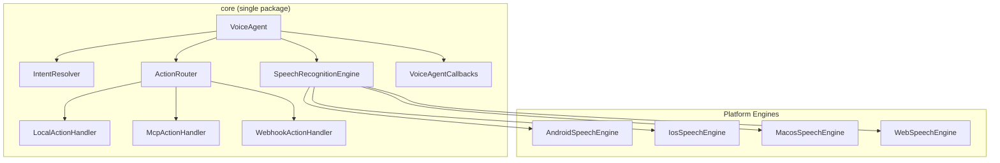

# V8V

An open-source, cross-platform voice orchestration framework built with **Kotlin Multiplatform**. Uses **native on-device speech-to-text** to turn spoken language into **local app actions**, **cross-app commands via MCP**, or **remote workflows via webhooks** — offline-first, multilingual, and privacy-respecting.

```
Microphone → Native STT → Transcript → Intent Resolver → Action Router
                                                           ├── LOCAL  (in-app lambda)
                                                           ├── MCP    (local cross-app)
                                                           └── REMOTE (n8n webhook)
```

No audio upload by default. Everything runs on-device unless explicitly configured otherwise.

**Single package everywhere** — one dependency per platform, includes LOCAL + MCP + REMOTE support:

| Platform | Package |
|----------|---------|
| Android / Kotlin | `io.github.alimomin1998:core-android:0.3.0` |
| iOS / macOS | `V8VCore.xcframework` via SPM |
| Web / JS / TS | `v8v-core@0.3.0` on npm |
| React (Web) | `v8v-core@0.3.0` on npm + custom hook |
| Flutter | Native bridge via Method Channels |
| JVM | `io.github.alimomin1998:core-jvm:0.3.0` |

---

## Platform Support

| Platform | Status | Engine | Distribution |
|----------|--------|--------|-------------|
| Android | Available | `android.speech.SpeechRecognizer` | Maven Central / Gradle |
| iOS | Available | `SFSpeechRecognizer` + `AVAudioEngine` | XCFramework / SPM |
| macOS | Available | `SFSpeechRecognizer` + `AVAudioEngine` | XCFramework / SPM |
| Web | Available | Web Speech API | npm / `<script>` |
| React (Web) | Available | Web Speech API (via `v8v-core` npm) | npm |
| Flutter | Community | Native bridge (Android + iOS engines) | Method Channels |
| JVM (Desktop) | Core only | Bring your own engine | Maven Central |
| Windows | Planned | — | — |
| Linux | Planned | — | — |

### Compatibility Matrix

| Dependency | Minimum | Tested |
|-----------|---------|--------|
| **Android SDK** | API 24 (Android 7.0) | API 35 (Android 15) |
| **iOS** | 16.0 | 17+ |
| **macOS** | 13.0 (Ventura) | 14+ (Sonoma) |
| **Web Browser** | Chrome 33+ / Edge 79+ | Chrome 120+ |
| **Safari (Web)** | Not supported (no Web Speech API) | — |
| **Firefox (Web)** | Not supported (no Web Speech API) | — |
| **JDK** | 17 | 17 |
| **Kotlin** | 2.1.20 | 2.1.20 |
| **Gradle** | 8.0 | 8.7+ |
| **Xcode** | 15.0 | 15+ |
| **Ktor** | 3.0.3 | 3.0.3 |
| **Node.js** (MCP server) | 18+ | 20+ |

## Architecture



### Project Structure

```
v8v/
├── core/                  # Single KMP module: VoiceAgent + MCP + Webhooks
│   ├── commonMain/        # Shared: VoiceAgent, IntentResolver, ActionRouter,
│   │                      #   McpClient, McpActionHandler, WebhookActionHandler
│   ├── androidMain/       # Android SpeechRecognizer + Ktor OkHttp engine
│   ├── iosMain/           # iOS SFSpeechRecognizer + AVAudioSession
│   ├── macosMain/         # macOS SFSpeechRecognizer (no AVAudioSession)
│   ├── jsMain/            # Web Speech API + @JsExport facade (VoiceAgentJs)
│   ├── appleMain/         # Shared Apple: Ktor Darwin engine + Timestamp
│   └── jvmMain/           # JVM stub + Timestamp
├── example-android/       # Android app — all 3 scopes + embedded mock MCP server
├── example-ios/           # iOS SwiftUI app — all 3 scopes + settings
├── example-macos/         # macOS SwiftUI app — all 3 scopes + settings
├── example-web/           # Web app — all 3 scopes (HTML + vanilla JS, no bundler)
├── example-mcp-server/    # Standalone MCP server (Node.js) for testing
└── Package.swift          # Swift Package Manager manifest
```

---

## Quick Start

### Android / Kotlin

**1. Add dependency** (Gradle):

```kotlin
// settings.gradle.kts
dependencyResolutionManagement {
    repositories {
        mavenCentral()
    }
}

// build.gradle.kts
dependencies {
    implementation("io.github.alimomin1998:core-android:0.3.0")
}
```

**2. Use VoiceAgentCallbacks** (same callback API as iOS/macOS/Web):

```kotlin
val agent = VoiceAgentCallbacks(
    engine = createPlatformEngine(context),
    config = VoiceAgentConfig(
        language = "en-US",
        continuous = true,
        partialResults = true,
        fuzzyThreshold = 0.3f,
        silenceTimeoutMs = 1500L,
    ),
)

// Callbacks — identical pattern across all platforms
agent.onTranscript { text -> println("Heard: $text") }
agent.onIntent { intent, message -> println("$intent: $message") }
agent.onError { msg -> println("Error: $msg") }

// LOCAL action
agent.registerLocalAction(
    intent = "task.create",
    phrases = mapOf("en-US" to listOf("create task *", "add task *")),
) { resolved ->
    taskService.createTask(resolved.extractedText)
}

// MCP action (cross-app via local MCP server)
agent.registerMcpAction(
    intent = "task.sync",
    phrases = mapOf("en-US" to listOf("sync task *")),
    serverUrl = "http://localhost:3001/mcp",
    toolName = "create_task",
)

// REMOTE action (webhook)
agent.registerWebhookAction(
    intent = "notify.team",
    phrases = mapOf("en-US" to listOf("notify *")),
    webhookUrl = "https://n8n.example.com/webhook/voice",
)

agent.start()
```

Try: **"create task prepare Q3 budget draft"**.

> **Advanced:** If you prefer Kotlin Flows over callbacks, use `VoiceAgent` directly — it exposes `transcript`, `actionResults`, `errors`, `state`, and `audioLevel` as Flows.

### iOS / macOS (Swift)

**1. Add via Swift Package Manager:**

In Xcode: File > Add Package Dependencies > paste this repo URL.

Or add to `Package.swift`:

```swift
.package(url: "https://github.com/alimomin1998/v8v.git", from: "0.3.0")
```

**2. Use VoiceAgentCallbacks from Swift** (same callback API as Android/Web):

```swift
import V8VCore

let agent = VoiceAgentCallbacks(
    engine: MacosSpeechEngine(),  // or IosSpeechEngine() on iOS
    config: VoiceAgentConfig(
        language: "en-US",
        continuous: true,
        partialResults: true,
        fuzzyThreshold: 0.3,
        silenceTimeoutMs: 1500
    ),
    permissionHelper: MacosPermissionHelper()  // or IosPermissionHelper()
)

agent.onTranscript { text in print("Heard: \(text)") }
agent.onIntent { intent, message in print("\(intent): \(message)") }
agent.onError { msg in print("Error: \(msg)") }

// LOCAL action
agent.registerLocalAction(
    intent: "task.create",
    phrases: ["en-US": ["create task *", "add task *"]],
    handler: { resolved in
        print("Create task: \(resolved.extractedText)")
    }
)

// MCP action
agent.registerMcpAction(
    intent: "task.sync",
    phrases: ["en-US": ["sync task *"]],
    serverUrl: "http://localhost:3001/mcp",
    toolName: "create_task"
)

// REMOTE action
agent.registerWebhookAction(
    intent: "notify.team",
    phrases: ["en-US": ["notify *"]],
    webhookUrl: "https://n8n.example.com/webhook/voice"
)

agent.start()
```

> **Why VoiceAgentCallbacks?** Kotlin Flows cannot be directly observed from Swift. `VoiceAgentCallbacks` internally collects all Flows and invokes simple callbacks.

**Requirements:**
- iOS: `NSMicrophoneUsageDescription` and `NSSpeechRecognitionUsageDescription` in Info.plist
- macOS: `com.apple.security.device.audio-input` entitlement + `NSSpeechRecognitionUsageDescription` in Info.plist
- iOS requires a **real device** (simulator does not support speech recognition)

### Web (JavaScript / TypeScript)

**1. Install:**

```bash
npm install v8v-core
```

**2. Load UMD scripts** (no bundler needed):

```html
<script src="node_modules/v8v-core/kotlin-kotlin-stdlib.js"></script>
<script src="node_modules/v8v-core/kotlinx-atomicfu.js"></script>
<script src="node_modules/v8v-core/kotlinx-coroutines-core.js"></script>
<!-- ... other Ktor/serialization deps ... -->
<script src="node_modules/v8v-core/v8v-core.js"></script>
```

See `example-web/index.html` for the full list of script tags in the correct order.

**3. Use VoiceAgentJs** (same callback API as Android/iOS/macOS):

```javascript
const mod = globalThis['io.github.alimomin1998:core'];
const agent = new mod.io.v8v.core.VoiceAgentJs('en');

agent.onTranscript(text => console.log('Heard:', text));
agent.onIntent((intent, message) => console.log(intent, message));
agent.onError(msg => console.error(msg));

// LOCAL action
agent.registerPhrase('todo.add', 'en', 'add *');

// MCP action (via library's built-in Ktor-based McpClient)
agent.registerMcpAction('task.create', 'en',
    ['create task *', 'new task *'],
    'http://localhost:3001/mcp', 'create_task');

// REMOTE action (via library's built-in Ktor-based WebhookActionHandler)
agent.registerWebhookAction('notify.team', 'en',
    ['notify *', 'send notification *'],
    'https://n8n.example.com/webhook/voice');

// Request mic permission first (must be in click handler)
const stream = await navigator.mediaDevices.getUserMedia({ audio: true });
stream.getTracks().forEach(t => t.stop());

agent.start();
```

### React (Web)

V8V works in React web apps using the same `v8v-core` npm package. Create a custom hook to wrap `VoiceAgentJs`:

**1. Install:**

```bash
npm install v8v-core
```

**2. Load UMD scripts** in `public/index.html` (before your React bundle):

```html
<script src="node_modules/v8v-core/kotlin-kotlin-stdlib.js"></script>
<script src="node_modules/v8v-core/kotlinx-atomicfu.js"></script>
<script src="node_modules/v8v-core/kotlinx-coroutines-core.js"></script>
<!-- ... other Ktor/serialization deps ... -->
<script src="node_modules/v8v-core/v8v-core.js"></script>
```

See `example-web/index.html` for the full list of script tags in order.

**3. Create a custom hook** (`useVoiceAgent.js`):

```javascript
import { useState, useEffect, useRef, useCallback } from 'react';

export function useVoiceAgent(language = 'en') {
    const agentRef = useRef(null);
    const [transcript, setTranscript] = useState('');
    const [error, setError] = useState('');
    const [listening, setListening] = useState(false);

    useEffect(() => {
        const mod = globalThis['io.github.alimomin1998:core'];
        if (!mod) return;

        const VoiceAgentJs = mod.io.v8v.core.VoiceAgentJs;
        const agent = new VoiceAgentJs(language);

        agent.onTranscript(text => setTranscript(text));
        agent.onError(msg => setError(msg));

        agentRef.current = agent;
        return () => agent.destroy();
    }, [language]);

    const registerPhrase = useCallback((intent, lang, phrase) => {
        agentRef.current?.registerPhrase(intent, lang, phrase);
    }, []);

    const registerMcpAction = useCallback((intent, lang, phrases, url, tool) => {
        agentRef.current?.registerMcpAction(intent, lang, phrases, url, tool);
    }, []);

    const registerWebhookAction = useCallback((intent, lang, phrases, url) => {
        agentRef.current?.registerWebhookAction(intent, lang, phrases, url);
    }, []);

    const start = useCallback(async () => {
        try {
            const stream = await navigator.mediaDevices.getUserMedia({ audio: true });
            stream.getTracks().forEach(t => t.stop());
        } catch (e) { /* proceed anyway */ }
        agentRef.current?.start();
        setListening(true);
    }, []);

    const stop = useCallback(() => {
        agentRef.current?.stop();
        setListening(false);
    }, []);

    return {
        transcript, error, listening,
        registerPhrase, registerMcpAction, registerWebhookAction,
        onIntent: (cb) => agentRef.current?.onIntent(cb),
        start, stop,
    };
}
```

**4. Use in a component:**

```jsx
import { useVoiceAgent } from './useVoiceAgent';

function VoiceApp() {
    const { transcript, error, listening, registerPhrase, start, stop } = useVoiceAgent('en');
    const [todos, setTodos] = useState([]);

    useEffect(() => {
        registerPhrase('todo.add', 'en', 'add *');
    }, [registerPhrase]);

    return (
        <div>
            <button onClick={listening ? stop : start}>
                {listening ? 'Stop' : 'Start Listening'}
            </button>
            <p>Heard: {transcript}</p>
            {error && <p style={{ color: 'red' }}>{error}</p>}
        </div>
    );
}
```

> **Note:** `v8v-core` uses the Web Speech API under the hood, so React web apps get the same browser-based speech recognition. For React Native, see Flutter below — the approach is similar (native bridge).

### Flutter

Flutter apps use V8V via **platform channels** that bridge to the native Android and iOS libraries. The Dart side sends commands and receives callbacks; the native side runs V8V.

**1. Add native dependencies:**

**Android** (`android/app/build.gradle`):
```groovy
dependencies {
    implementation 'io.github.alimomin1998:core-android:0.3.0'
}
```

**iOS** (`ios/Podfile` or via SPM):
Add the `V8VCore.xcframework` to your iOS project via Swift Package Manager (File > Add Package > paste repo URL).

**2. Create the platform channel** (Dart side — `lib/v8v_voice_agent.dart`):

```dart
import 'package:flutter/services.dart';

class V8VVoiceAgent {
  static const _channel = MethodChannel('v8v_voice_agent');

  Function(String)? onTranscript;
  Function(String, String)? onIntent;
  Function(String)? onError;

  V8VVoiceAgent() {
    _channel.setMethodCallHandler((call) async {
      switch (call.method) {
        case 'onTranscript':
          onTranscript?.call(call.arguments as String);
          break;
        case 'onIntent':
          final args = call.arguments as Map;
          onIntent?.call(args['intent'], args['message']);
          break;
        case 'onError':
          onError?.call(call.arguments as String);
          break;
      }
    });
  }

  Future<void> registerLocalAction(String intent, String lang, List<String> phrases) =>
      _channel.invokeMethod('registerLocalAction', {
        'intent': intent, 'language': lang, 'phrases': phrases,
      });

  Future<void> registerMcpAction(String intent, String lang,
      List<String> phrases, String serverUrl, String toolName) =>
      _channel.invokeMethod('registerMcpAction', {
        'intent': intent, 'language': lang, 'phrases': phrases,
        'serverUrl': serverUrl, 'toolName': toolName,
      });

  Future<void> registerWebhookAction(String intent, String lang,
      List<String> phrases, String webhookUrl) =>
      _channel.invokeMethod('registerWebhookAction', {
        'intent': intent, 'language': lang, 'phrases': phrases,
        'webhookUrl': webhookUrl,
      });

  Future<void> start() => _channel.invokeMethod('start');
  Future<void> stop() => _channel.invokeMethod('stop');
  Future<void> destroy() => _channel.invokeMethod('destroy');
}
```

**3. Implement the native bridge:**

**Android** (`android/app/src/main/kotlin/.../V8VPlugin.kt`):

```kotlin
class V8VPlugin(private val activity: Activity) : MethodChannel.MethodCallHandler {
    private val channel = MethodChannel(
        (activity as FlutterActivity).flutterEngine!!.dartExecutor.binaryMessenger,
        "v8v_voice_agent"
    )
    private val agent = VoiceAgentCallbacks(
        engine = createPlatformEngine(activity),
        config = VoiceAgentConfig(),
    )

    init {
        channel.setMethodCallHandler(this)

        // Forward callbacks to Dart
        agent.onTranscript { text ->
            activity.runOnUiThread { channel.invokeMethod("onTranscript", text) }
        }
        agent.onIntent { intent, message ->
            activity.runOnUiThread {
                channel.invokeMethod("onIntent", mapOf("intent" to intent, "message" to message))
            }
        }
        agent.onError { msg ->
            activity.runOnUiThread { channel.invokeMethod("onError", msg) }
        }
    }

    override fun onMethodCall(call: MethodCall, result: MethodChannel.Result) {
        when (call.method) {
            "registerLocalAction" -> {
                val intent = call.argument<String>("intent")!!
                val lang = call.argument<String>("language")!!
                val phrases = call.argument<List<String>>("phrases")!!
                agent.registerLocalAction(intent, mapOf(lang to phrases)) { }
                result.success(null)
            }
            "registerMcpAction" -> {
                val intent = call.argument<String>("intent")!!
                val lang = call.argument<String>("language")!!
                val phrases = call.argument<List<String>>("phrases")!!
                agent.registerMcpAction(
                    intent, mapOf(lang to phrases),
                    call.argument<String>("serverUrl")!!,
                    call.argument<String>("toolName")!!,
                )
                result.success(null)
            }
            "registerWebhookAction" -> {
                val intent = call.argument<String>("intent")!!
                val lang = call.argument<String>("language")!!
                val phrases = call.argument<List<String>>("phrases")!!
                agent.registerWebhookAction(
                    intent, mapOf(lang to phrases),
                    call.argument<String>("webhookUrl")!!,
                )
                result.success(null)
            }
            "start" -> { agent.start(); result.success(null) }
            "stop" -> { agent.stop(); result.success(null) }
            "destroy" -> { agent.destroy(); result.success(null) }
            else -> result.notImplemented()
        }
    }
}
```

**iOS** — same pattern using `FlutterMethodChannel` and `VoiceAgentCallbacks` from the XCFramework.

**4. Use in a Flutter widget:**

```dart
final agent = V8VVoiceAgent();

// Callbacks — same pattern as Android/iOS/Web
agent.onTranscript = (text) => setState(() => transcript = text);
agent.onIntent = (intent, message) => print('$intent: $message');
agent.onError = (msg) => print('Error: $msg');

await agent.registerLocalAction('todo.add', 'en', ['add *']);
await agent.registerMcpAction('task.create', 'en',
    ['create task *'], 'http://localhost:3001/mcp', 'create_task');

await agent.start();
```

> **How it works:** The Dart side is a thin MethodChannel wrapper. All voice processing, intent matching, MCP calls, and webhook calls run natively via the V8V library — no Dart speech plugins needed.

---

## Core API

### VoiceAgent

The main entry point. Wires a speech engine, intent resolver, and action router together.

| Method | Description |
|--------|-------------|
| `registerAction(intent, phrases, handler)` | Register a voice command |
| `start()` | Begin listening |
| `stop()` | Stop listening |
| `updateConfig(config)` | Change language, continuous mode, fuzzy threshold at runtime |
| `destroy()` | Release all resources |

| Flow / State | Type | Description |
|-------------|------|-------------|
| `state` | `StateFlow<AgentState>` | `IDLE`, `LISTENING`, `PROCESSING` |
| `transcript` | `SharedFlow<String>` | Every final (or partial) transcript |
| `errors` | `SharedFlow<VoiceAgentError>` | Structured errors (permission, engine, action) |
| `actionResults` | `SharedFlow<ActionResult>` | Success/Error from dispatched actions |
| `audioLevel` | `StateFlow<Float>` | Normalized 0.0-1.0 mic volume |

### VoiceAgentJs (Web)

JavaScript-friendly facade with MCP + webhook support:

| Method | Description |
|--------|-------------|
| `registerPhrase(intent, lang, pattern)` | Register a LOCAL voice command |
| `registerMcpAction(intent, lang, phrases[], serverUrl, toolName)` | Register MCP action (Ktor HTTP) |
| `registerWebhookAction(intent, lang, phrases[], webhookUrl)` | Register webhook action (Ktor HTTP) |
| `onTranscript(callback)` | Called on each transcript |
| `onIntent(callback)` | Called with `(intentName, message)` |
| `onError(callback)` | Called on errors |
| `onUnhandled(callback)` | Called when no intent matched |
| `start()` / `stop()` / `destroy()` | Lifecycle |

### VoiceAgentCallbacks (Android / iOS / macOS)

Callback-based facade available on **all platforms** (lives in `commonMain`). Provides a uniform API whether you're in Kotlin, Swift, or any KMP target:

| Method | Description |
|--------|-------------|
| `onTranscript(callback)` | Called on each transcript |
| `onIntent(callback)` | Called with `(intentName, message)` on success |
| `onError(callback)` | Called on errors (engine + action failures) |
| `onUnhandled(callback)` | Called when no intent matched |
| `onStateChange(callback)` | Called on IDLE/LISTENING/PROCESSING |
| `onAudioLevel(callback)` | Called with mic volume (0.0-1.0) |
| `registerLocalAction(intent, phrases, handler)` | Register a LOCAL action |
| `registerMcpAction(intent, phrases, serverUrl, toolName)` | Register an MCP action |
| `registerWebhookAction(intent, phrases, webhookUrl)` | Register a webhook action |

### VoiceAgentConfig

| Property | Type | Default | Description |
|----------|------|---------|-------------|
| `language` | `String` | `"en"` | BCP-47 language tag |
| `continuous` | `Boolean` | `true` | Auto-restart after each utterance |
| `partialResults` | `Boolean` | `false` | Forward partial transcripts |
| `fuzzyThreshold` | `Float` | `0.0` | Dice similarity threshold (0 = exact only) |
| `silenceTimeoutMs` | `Long` | `1500` | Auto-promote partial to final after silence (ms) |

### Action Scopes

| Scope | Handler | Use Case |
|-------|---------|----------|
| `LOCAL` | `LocalActionHandler` | In-app actions, offline, default |
| `MCP` | `McpActionHandler` | Cross-app via local MCP server |
| `REMOTE` | `WebhookActionHandler` | Cloud workflows via n8n/Zapier |

### Intent Matching

Register `*` wildcard patterns in any language:

```kotlin
agent.registerAction(
    intent = "task.create",
    phrases = mapOf(
        "en-US" to listOf("create task *", "add task *"),
        "hi-IN" to listOf("* task banao"),
        "es" to listOf("crear tarea *"),
    ),
) { /* ... */ }
```

**Pass 1 — Wildcard regex:** Pattern `create task *` becomes regex `^create task (.+)$`. Exact match gives confidence 1.0.

**Pass 2 — Fuzzy (Dice similarity):** When `fuzzyThreshold > 0` and exact matching fails:

```
Dice = (2 * |intersection|) / (|A| + |B|)
```

---

## Building from Source

### Prerequisites

- JDK 17+
- Android SDK 35
- Xcode 15+ (for Apple targets)

### Build & Test

```bash
# JVM + JS compilation
./gradlew :core:compileKotlinJvm :core:compileKotlinJs

# Run tests (all merged into core)
./gradlew :core:jvmTest

# Android example
./gradlew :example-android:assembleDebug

# Build XCFramework (iOS + macOS)
./gradlew :core:assembleV8VCoreReleaseXCFramework

# Lint check (ktlint)
./gradlew ktlintCheck
```

### Publishing

```bash
# Full release (Maven Central + npm + XCFramework)
./scripts/release.sh 0.3.0

# Or individually:
./gradlew publishAndReleaseToMavenCentral         # Maven Central
./gradlew :core:jsBrowserProductionLibraryDistribution  # npm (then cd output && npm publish)
./gradlew :core:assembleV8VCoreReleaseXCFramework  # XCFramework
```

---

## Running Examples

### Android

```bash
./gradlew :example-android:installDebug
```

Uses `io.github.alimomin1998:core-android:0.3.0` from Maven Central.

Try: **"add project status update"** (LOCAL), **"create task schedule review"** (MCP), **"notify team build is ready"** (REMOTE)

### Web

```bash
cd example-web
npm install    # installs v8v-core@0.3.0 from npm
npm start      # serves on http://localhost:5174
```

Open in Chrome. Set MCP URL to `http://localhost:3001/mcp` in Settings (optional).

### iOS (SwiftUI)

```bash
./gradlew :core:assembleV8VCoreReleaseXCFramework
open example-ios/V8VPhone.xcodeproj
```

Requires a **real device** — the iOS Simulator does not support speech recognition.

### macOS (SwiftUI)

```bash
./gradlew :core:assembleV8VCoreReleaseXCFramework
open example-macos/V8VMac.xcodeproj
```

### Standalone MCP Server (for testing)

```bash
node example-mcp-server/server.js          # port 3001
node example-mcp-server/server.js --cors    # with CORS for web
node example-mcp-server/server.js --port 4000
```

See [example-mcp-server/README.md](example-mcp-server/README.md) for full docs.

---
## License

```
Copyright 2026 V8V Contributors
Licensed under the Apache License, Version 2.0
```

See [LICENSE](LICENSE) for the full text.
