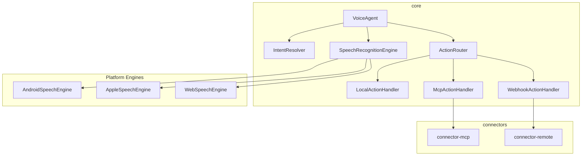
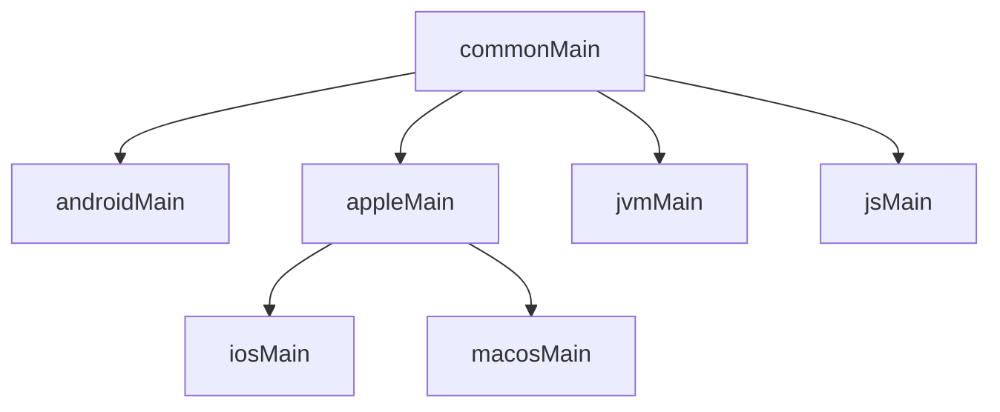

# V8V

An open-source, cross-platform voice orchestration framework built with **Kotlin Multiplatform**. Uses **native on-device speech-to-text** to turn spoken language into **local app actions**, **cross-app commands via MCP**, or **remote workflows via webhooks** — offline-first, multilingual, and privacy-respecting.

```
Microphone → Native STT → Transcript → Intent Resolver → Action Router
                                                           ├── LOCAL  (in-app lambda)
                                                           ├── MCP    (local cross-app)
                                                           └── REMOTE (n8n webhook)
```

No audio upload by default. Everything runs on-device unless explicitly configured otherwise.

---

## Platform Support

| Platform | Status | Engine | Distribution |
|----------|--------|--------|-------------|
| Android | ✅ Available | `android.speech.SpeechRecognizer` | Maven Central / Gradle |
| iOS | ✅ Available | `SFSpeechRecognizer` + `AVAudioEngine` | XCFramework / SPM |
| macOS | ✅ Available | `SFSpeechRecognizer` + `AVAudioEngine` | XCFramework / SPM |
| Web | ✅ Available | Web Speech API | npm / `<script>` |
| JVM (Desktop) | ✅ Core only | Bring your own engine | Maven Central |
| Windows | 🔜 Planned | — | — |
| Linux | 🔜 Planned | — | — |

### Compatibility Matrix

| Dependency | Minimum | Tested |
|-----------|---------|--------|
| **Android SDK** | API 24 (Android 7.0) | API 35 (Android 15) |
| **iOS** | 15.0 | 17+ |
| **macOS** | 13.0 (Ventura) | 14+ (Sonoma) |
| **Web Browser** | Chrome 33+ / Edge 79+ | Chrome 120+ |
| **Safari (Web)** | Not supported (no Web Speech API) | — |
| **Firefox (Web)** | Not supported (no Web Speech API) | — |
| **JDK** | 17 | 17 |
| **Kotlin** | 2.1.20 | 2.1.20 |
| **Gradle** | 8.0 | 8.7+ |
| **Xcode** | 15.0 | 15+ |
| **Ktor** | 3.0.3 | 3.0.3 |
| **Node.js** (MCP server) | 18+ | 20+ |

## Architecture



### Source Set Hierarchy



### Project Structure

```
v8v/
├── core/                  # Platform-agnostic: VoiceAgent, IntentResolver, ActionRouter
│   ├── commonMain/        # Shared Kotlin code
│   ├── androidMain/       # Android SpeechRecognizer
│   ├── appleMain/         # iOS + macOS SFSpeechRecognizer
│   ├── jsMain/            # Web Speech API + @JsExport facade
│   └── jvmMain/           # JVM stub
├── connector-mcp/         # MCP client (JSON-RPC 2.0 over local HTTP)
├── connector-remote/      # Webhook client (n8n, Zapier, Make, etc.)
├── example-android/       # Android app — all 3 scopes + embedded mock MCP server
├── example-web/           # Web app — all 3 scopes (HTML + vanilla JS, no bundler)
├── example-jvm/           # JVM CLI app — all 3 scopes (typed input as simulated speech)
├── example-macos/         # macOS SwiftUI app (copy into Xcode project)
├── example-mcp-server/    # Standalone MCP server (Node.js) for real testing
└── Package.swift          # Swift Package Manager manifest
```

---

## Quick Start

### Android / Kotlin

**1. Add dependency** (Gradle):

```kotlin
// settings.gradle.kts
dependencyResolutionManagement {
    repositories {
        mavenCentral()
    }
}

// build.gradle.kts
dependencies {
    implementation("io.v8v:core-android:0.1.0")
    // Optional connectors:
    implementation("io.v8v:connector-mcp-android:0.1.0")
    implementation("io.v8v:connector-remote-android:0.1.0")
}
```

**2. Use VoiceAgent:**

```kotlin
val agent = VoiceAgent(
    engine = createPlatformEngine(context),
    config = VoiceAgentConfig(language = "en"),
)

agent.registerAction(
    intent = "todo.add",
    phrases = mapOf("en" to listOf("add * to todo")),
) { resolved ->
    addTodo(resolved.extractedText)
}

agent.start()
```

Say **"add buy milk to todo"** — handler fires with `extractedText = "buy milk"`.

### iOS / macOS (Swift)

**1. Add via Swift Package Manager:**

In Xcode: File → Add Package Dependencies → paste this repo URL.

Or add to `Package.swift`:

```swift
.package(url: "https://github.com/AliHaider-codes/v8v.git", from: "0.1.0")
```

**2. Use from Swift:**

```swift
import V8VCore

let engine = AppleSpeechEngine()
let config = VoiceAgentConfig(language: "en")
let agent = VoiceAgent(engine: engine, config: config)

agent.registerAction(
    intent: "todo.add",
    phrases: ["en": ["add * to todo"]],
    handler: { resolved in
        print("Add: \(resolved.extractedText)")
    }
)

agent.start()
```

**Requirements:**
- iOS: `NSMicrophoneUsageDescription` and `NSSpeechRecognitionUsageDescription` in Info.plist
- macOS: `com.apple.security.device.audio-input` entitlement + `NSSpeechRecognitionUsageDescription` in Info.plist

### Web (JavaScript / TypeScript)

**Option A: npm package** (with bundler):

```bash
npm install v8v-core
```

```javascript
import { VoiceAgentJs } from 'v8v-core';

const agent = new VoiceAgentJs('en');
agent.registerPhrase('todo.add', 'en', 'add *');
agent.onTranscript(text => console.log('Heard:', text));
agent.onIntent((intent, text) => console.log(intent, text));
agent.onError(msg => console.error(msg));
agent.start();
```

**Option B: Standalone** (no bundler):

Open `example-web/index.html` in Chrome. See the [example-web/](example-web/) folder.

---

## Core API

### VoiceAgent

The main entry point. Wires a speech engine, intent resolver, and action router together.

| Method | Description |
|--------|-------------|
| `registerAction(intent, phrases, handler)` | Register a voice command |
| `start()` | Begin listening |
| `stop()` | Stop listening |
| `updateConfig(config)` | Change language, continuous mode, fuzzy threshold at runtime |
| `destroy()` | Release all resources |

| Flow / State | Type | Description |
|-------------|------|-------------|
| `state` | `StateFlow<AgentState>` | `IDLE`, `LISTENING`, `PROCESSING` |
| `transcript` | `SharedFlow<String>` | Every final (or partial) transcript |
| `errors` | `SharedFlow<VoiceAgentError>` | Structured errors (permission, engine, action) |
| `actionResults` | `SharedFlow<ActionResult>` | Success/Error from dispatched actions |
| `audioLevel` | `StateFlow<Float>` | Normalized 0.0–1.0 mic volume |

### Action Scopes

| Scope | Handler | Use Case |
|-------|---------|----------|
| `LOCAL` | `LocalActionHandler` | In-app actions, offline, default |
| `MCP` | `McpActionHandler` | Cross-app via local MCP server |
| `REMOTE` | `WebhookActionHandler` | Cloud workflows via n8n/Zapier |

### Error Types

```kotlin
sealed class VoiceAgentError {
    data class PermissionDenied(val status: PermissionStatus)
    data class EngineError(val code: Int, val message: String)
    data class ActionFailed(val intent: String, val scope: ActionScope, val message: String)
}
```

### Intent Matching

Register `*` wildcard patterns in any language:

```kotlin
agent.registerAction(
    intent = "todo.add",
    phrases = mapOf(
        "en" to listOf("add * to todo", "add *"),
        "hi" to listOf("* todo mein add karo"),
        "es" to listOf("agregar * a la lista"),
    ),
) { /* ... */ }
```

Fuzzy matching uses Dice similarity. Configure the threshold via `VoiceAgentConfig.fuzzyThreshold`.

---

## MCP Integration (Cross-App)

```kotlin
val mcpClient = McpClient(
    McpServerConfig(name = "task-app", port = 3001),
)
mcpClient.initialize()

agent.registerAction(
    intent = "task.create",
    phrases = mapOf("en" to listOf("create task *")),
    handler = McpActionHandler(mcpClient, "create_task"),
)
```

Say **"create task buy groceries"** — calls the `create_task` tool on the local MCP server.

## Remote Webhooks (n8n)

```kotlin
agent.registerAction(
    intent = "notify.team",
    phrases = mapOf("en" to listOf("notify *")),
    handler = WebhookActionHandler(
        WebhookConfig(url = "https://n8n.example.com/webhook/voice"),
    ),
)
```

Say **"notify meeting at 3pm"** — POSTs a JSON payload to the webhook.

---

## Building from Source

### Prerequisites

- JDK 17+
- Android SDK 35
- Xcode 15+ (for Apple targets)

### Build & Test

```bash
# JVM + JS compilation
./gradlew :core:compileKotlinJvm :core:compileKotlinJs

# Run tests
./gradlew :core:jvmTest :connector-mcp:jvmTest :connector-remote:jvmTest

# Android example
./gradlew :example-android:assembleDebug

# Build XCFramework (iOS + macOS)
./gradlew assembleV8VCoreXCFrameworkRelease
```

### Publishing

```bash
# Maven Local (for local testing)
./gradlew publishToMavenLocal

# Maven Central (requires Sonatype credentials — see PUBLISHING.md)
./gradlew publishAllPublicationsToMavenCentralRepository

# npm (JS/TS)
./gradlew :core:jsBrowserProductionLibraryDistribution
# Output: core/build/dist/js/productionLibrary/
cd core/build/dist/js/productionLibrary && npm publish --access public

# Full release (all channels)
./scripts/release.sh 0.1.0
```

---

## Running Examples

### Android

1. Open in Android Studio
2. Select `example-android` run configuration
3. Run on a device with Google speech services
4. Try: **"add milk"**, **"create task buy groceries"**, **"notify meeting at 3pm"**

### Web (all 3 scopes)

1. Start the MCP server (optional, for MCP scope):
   ```bash
   node example-mcp-server/server.js --cors
   ```
2. Open `example-web/index.html` in Chrome
3. In Settings, set MCP URL to `http://localhost:3001/mcp`
4. Click the mic button
5. Try:
   - **"add milk"** — LOCAL scope
   - **"create task fix the bug"** — MCP scope (requires MCP server)
   - **"notify server is down"** — REMOTE scope (requires webhook URL)
   - **"list todos"** — LOCAL scope

### JVM CLI

1. Start the MCP server (optional):
   ```bash
   node example-mcp-server/server.js
   ```
2. Run the JVM example:
   ```bash
   ./gradlew :example-jvm:run
   ```
3. Type commands as if speaking:
   ```
   > add buy milk
   > create task fix the bug
   > list todos
   > quit
   ```

### macOS (SwiftUI)

See [example-macos/README.md](example-macos/README.md) for setup instructions.

### Standalone MCP Server (for testing)

A real MCP server with 4 tools (create, list, delete, search tasks):

```bash
node example-mcp-server/server.js          # port 3001
node example-mcp-server/server.js --cors    # with CORS for web
node example-mcp-server/server.js --port 4000
```

See [example-mcp-server/README.md](example-mcp-server/README.md) for full docs.

---

## Publishing & Distribution

See [PUBLISHING.md](PUBLISHING.md) for full instructions on publishing to:
- **Maven Central** (Android / Kotlin / JVM)
- **npm** (Web / JS / TS)
- **GitHub Releases + SPM** (iOS / macOS)

Automated release: `./scripts/release.sh 0.2.0`

---

## Contributing

Key areas where contributions are welcome:

- Windows adapter (Windows Speech API / SAPI)
- Linux adapter (Vosk or similar)
- AI/ML-based intent matching
- More MCP transport options (Android Bound Services)
- Additional connectors (gRPC, MQTT)
- Additional example apps

## License

```
Copyright 2026 V8V Contributors
Licensed under the Apache License, Version 2.0
```

See [LICENSE](LICENSE) for the full text.
